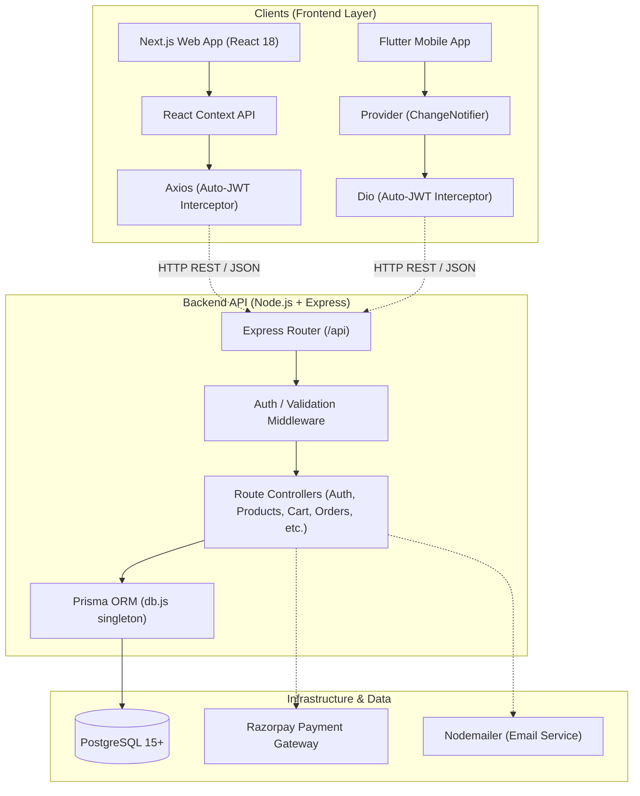
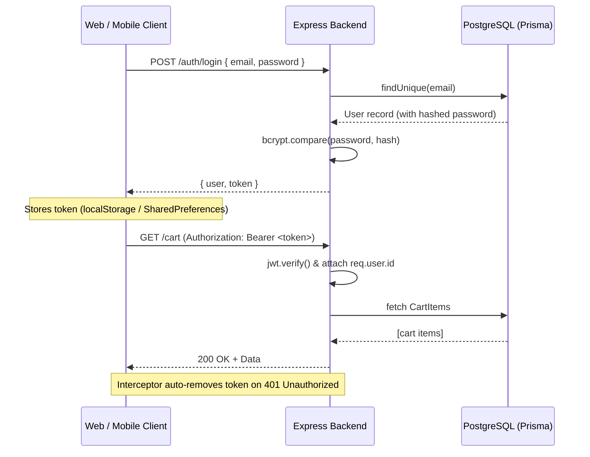
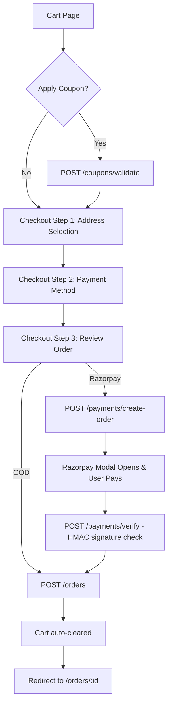
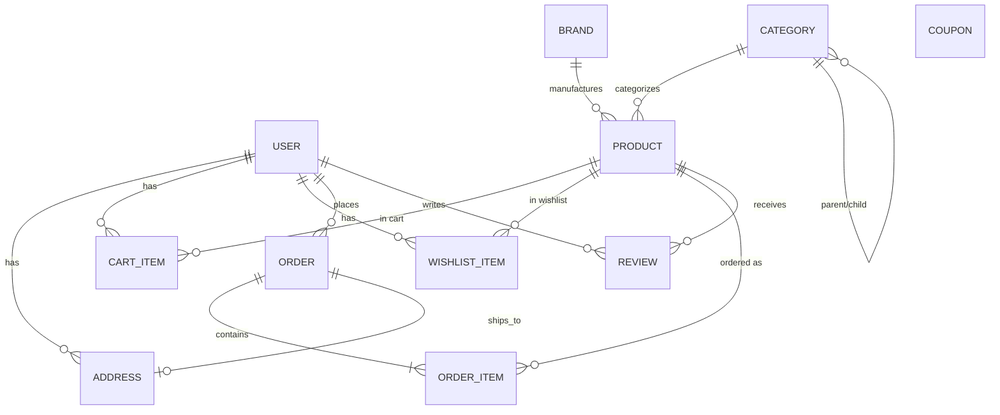

# GlamCart — System Architecture Overview

[](backend)
[](frontend)
[](glamcart_flutter)
[](backend/prisma)

GlamCart is a multi-platform e-commerce application. It features a unified Node.js REST API providing data to both a Next.js (React) web storefront and a Flutter mobile application. The backend uses Prisma ORM to interact with a PostgreSQL database, managing users, products, cart operations, orders, and payments.

---

## 🏗️ System Architecture Diagram

GlamCart follows a layered client-server architecture with dedicated frontend applications communicating via REST to a centralized backend API.



---

## 🛠️ Technology Stack

| Layer | Technology |
| :--- | :--- |
| **Web Frontend** | Next.js 14 (App Router), React 18, Tailwind CSS |
| **Mobile App** | Flutter (Dart) |
| **Backend API** | Node.js, Express.js |
| **Database & ORM** | PostgreSQL, Prisma 5 |
| **Authentication** | JWT (7-day expiry), bcryptjs |
| **HTTP Clients** | Axios (Web), Dio (Mobile) |
| **Payments** | Razorpay Gateway |
| **State Management** | React Context (Web), Provider (Mobile) |
| **Email Service** | Nodemailer |

---

## 🔐 Authentication Flow

Authentication relies on secure JWT tokens. Once authenticated, tokens are automatically attached to outbound requests by HTTP client interceptors.



---

## 🛒 Checkout & Payment Flow



---

## 🔄 State Management

### Web (React Context API)
- **AuthContext**: Manages `user` object and `loading` state. Handles `signIn()` (saves token, updates state) and `signOut()`.
- **CartContext**: Manages `cart` items array, `cartCount`, and `cartTotal`. Handles API mutations (`addItem`, `updateItem`, `removeItem`, `emptyCart`) and synchronizes state by refetching from the backend.

### Mobile (Flutter Provider)
- **AuthProvider**: `ChangeNotifier` managing `currentUser`. Reads token on app start (`init()`), handles login/register/logout.
- **CartProvider**: Manages `items` list, `itemCount`, and `totalPrice`. Methods like `addToCart()` and `updateItem()` throw exceptions on API failure, allowing UI screens to catch and display red snackbars.

---

## 🗄️ Database Models (Entity-Relationship)

GlamCart uses 11 core models defined in Prisma. 



| Core Entity | Key Constraints & Notes |
| :--- | :--- |
| **CartItem** | Unique composite constraint `[userId, productId]`. Upserts increment quantity. |
| **WishlistItem** | Unique composite constraint `[userId, productId]`. Idempotent upserts. |
| **Order / OrderItem** | `OrderItem.price` records a snapshot of the product price at the exact time of order. |
| **Category** | Self-referencing tree relation (`parentId`) for nested sub-categories. |
| **Coupon** | Validated during checkout, checking `minOrder`, `usageLimit`, and applying `PERCENT` or `FLAT` discounts. |

---

## 📁 Repository Directory Structure

```text
glamcart/
├── backend/                    # Node.js + Express REST API
│   ├── prisma/                 # Database ORM schema & seed scripts
│   │   ├── schema.prisma       # All 11 DB models
│   │   └── seed.js             # Sample data generator
│   └── src/
│       ├── index.js            # Express entry point & middleware setup
│       ├── db.js               # Singleton PrismaClient instance
│       ├── middleware/         # JWT authentication & authorization
│       ├── utils/              # Token generation, validation helpers
│       └── routes/             # Feature-based route handlers (auth, products, etc.)
│
├── frontend/                   # Next.js 14 Web Application
│   └── src/
│       ├── lib/api.js          # Axios configuration & HTTP interceptors
│       ├── context/            # React Contexts (Auth, Cart)
│       ├── components/         # Reusable UI primitives & layout elements
│       └── app/                # App Router pages (/, /products, /cart, /checkout)
│
└── glamcart_flutter/           # Flutter Mobile Application
    └── lib/
        ├── main.dart           # App entry point
        ├── config/             # API constants & configurations
        ├── models/             # Dart data models (User, Product, Order, etc.)
        ├── providers/          # State management (AuthProvider, CartProvider)
        ├── services/           # Network calls (api_service.dart)
        ├── screens/            # Application UI screens
        └── widgets/            # Reusable UI widgets
```

---

## 🎯 Key Design Decisions

1. **Prisma Singleton (`src/db.js`)**: Prevents PostgreSQL connection pool exhaustion by sharing a single instance across all Express routes.
2. **Auto-Injecting Interceptors**: Axios and Dio interceptors automatically attach the JWT token to outgoing requests and clear local storage on HTTP 401 Unauthorized responses.
3. **Price Snapshots**: `OrderItem` stores the product price at the time of purchase, preventing historical orders from changing total values if product prices are later updated.
4. **Validation Utilities**: Shared validation logic (`validate.js` / Express-Validator) is strictly used on the backend before executing DB operations.
5. **No False Success Toasts**: Frontend cart mutations throw errors rather than failing silently, allowing UI to handle and accurately report failures to the user.
